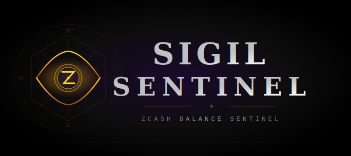

<p align="center">
  
</p>

<p align="center">
  <strong>Zcash balance monitoring service</strong><br/>
  <em>View-only surveillance of shielded and transparent pools via lightwalletd</em>
</p>

<p align="center">
  <a href="https://github.com/chippr-robotics/sigil-sentinel">
    
  </a>
  <a href="https://github.com/chippr-robotics/sigil-sentinel">
    
  </a>
  <a href="https://github.com/chippr-robotics/sigil-sentinel">
    
  </a>
</p>

---

## What is this

Sigil Sentinel is a Rust service that monitors Zcash account balances using **viewing keys only** — no spending keys ever touch the server. It connects to an existing [lightwalletd](https://github.com/zcash/lightwalletd) gRPC endpoint, syncs compact blocks with [zingolib](https://github.com/zingolabs/zingolib), and exposes balances as Prometheus metrics plus a REST management API.

Built to run alongside a Zebrad + lightwalletd stack where no wallet RPCs exist.

## Architecture

```
zebrad:8232 ──► lightwalletd:9067
                      │
                      ▼
             sigil-sentinel
             ├─ :9100 /metrics   (Prometheus)
             └─ :9101 /api       (Management API)
                      │
                      ▼
             prometheus ──► grafana
```

## Features

- **Shielded + transparent monitoring** — Sapling, Orchard, and transparent pool balances via UFVKs
- **Transaction history with memos** — decrypted memo fields from shielded transactions
- **Prometheus metrics** — per-account, per-pool balance gauges, sync status, chain height tracking
- **Runtime account management** — add/remove viewing keys via REST API without restarting
- **Persistent state** — accounts and sync progress survive container restarts
- **Watch-only** — only viewing keys, never spending keys

## Quick Start

### Docker Compose (recommended)

```yaml
zcash-sentinel:
  build:
    context: ./zcash-sentinel
    dockerfile: Dockerfile
  container_name: zcash-sentinel
  restart: unless-stopped
  depends_on:
    lightwalletd:
      condition: service_healthy
  ports:
    - "9101:9101"
  volumes:
    - ./zcash-sentinel/config.toml:/etc/zcash-sentinel/config.toml:ro
    - sentinel-data:/var/lib/zcash-sentinel
  networks:
    - zcash-internal
```

```bash
docker compose build zcash-sentinel
docker compose up -d zcash-sentinel
```

### Configuration

```toml
[lightwalletd]
endpoint = "http://lightwalletd:9067"

[server]
metrics_bind = "0.0.0.0:9100"
api_bind = "0.0.0.0:9101"

[scanner]
poll_interval_secs = 60
default_birthday_height = 2000000

[storage]
accounts_file = "/var/lib/zcash-sentinel/accounts.json"
```

## API Reference

### Health

```
GET /api/health
```

```json
{
  "status": "ok",
  "watched_accounts": 2,
  "watched_addresses": 1,
  "lightwalletd_endpoint": "http://lightwalletd:9067"
}
```

### Add a shielded account

```
POST /api/accounts
Content-Type: application/json

{
  "label": "cold-storage",
  "viewing_key": "uview1q...",
  "birthday_height": 2000000
}
```

The `birthday_height` is optional (defaults to config value). Set it to the block height when the key was created to avoid a full chain rescan.

### Add a transparent address

```
POST /api/addresses
Content-Type: application/json

{
  "label": "legacy-t1",
  "address": "t1abc..."
}
```

### List accounts

```
GET /api/accounts
```

```json
[
  {
    "label": "cold-storage",
    "type": "shielded",
    "balances": {
      "transparent_zatoshis": 0,
      "sapling_zatoshis": 150000000,
      "orchard_zatoshis": 50000000,
      "total_zatoshis": 200000000,
      "total_zec": 2.0
    },
    "last_synced_height": 2500000
  }
]
```

### Get account detail

```
GET /api/accounts/{label}
```

### Get transactions and memos

```
GET /api/accounts/{label}/transactions
```

```json
{
  "label": "cold-storage",
  "count": 3,
  "transactions": [
    {
      "txid": "abc123...",
      "datetime": 1710187200,
      "status": "Confirmed(2500000)",
      "blockheight": 2500000,
      "kind": "received",
      "value": 50000000,
      "pool_received": "orchard",
      "memos": ["Payment for March"]
    }
  ]
}
```

Transaction `kind` values: `received`, `sent`, `shield`, `send-to-self`, `memo-to-self`

### Remove an account

```
DELETE /api/accounts/{label}
```

## Prometheus Metrics

Exposed on `:9100/metrics`:

| Metric | Type | Labels | Description |
|--------|------|--------|-------------|
| `zcash_balance_zatoshis` | gauge | `account`, `pool` | Balance per account per pool |
| `zcash_total_balance_zec` | gauge | `account` | Total balance in ZEC |
| `zcash_sync_height` | gauge | `account` | Last synced block height |
| `zcash_chain_height` | gauge | — | Chain tip from lightwalletd |
| `zcash_sync_lag_blocks` | gauge | `account` | Blocks behind chain tip |
| `zcash_last_sync_duration_seconds` | gauge | — | Duration of last sync cycle |
| `zcash_watched_accounts_total` | gauge | — | Number of monitored accounts |

### Prometheus scrape config

```yaml
- job_name: 'zcash-sentinel'
  scrape_interval: 30s
  metrics_path: '/metrics'
  static_configs:
    - targets: ['zcash-sentinel:9100']
```

## Viewing Key Safety

Only **viewing keys** (UFVKs or Sapling IVKs) are used. These allow reading transaction history and balances but **cannot spend funds**. Extract them offline:

```bash
# On air-gapped machine with zcashd:
zcash-cli z_exportviewingkey <z-address>

# For HD wallets: derive UFVKs from the seed phrase
```

Never place spending keys on the monitoring server.

## Building from Source

Requires Rust 1.90+ (edition 2024) and protobuf compiler:

```bash
apt-get install protobuf-compiler
cargo build --release
./target/release/zcash-sentinel --config config.toml
```

## License

See [LICENSE](LICENSE).
