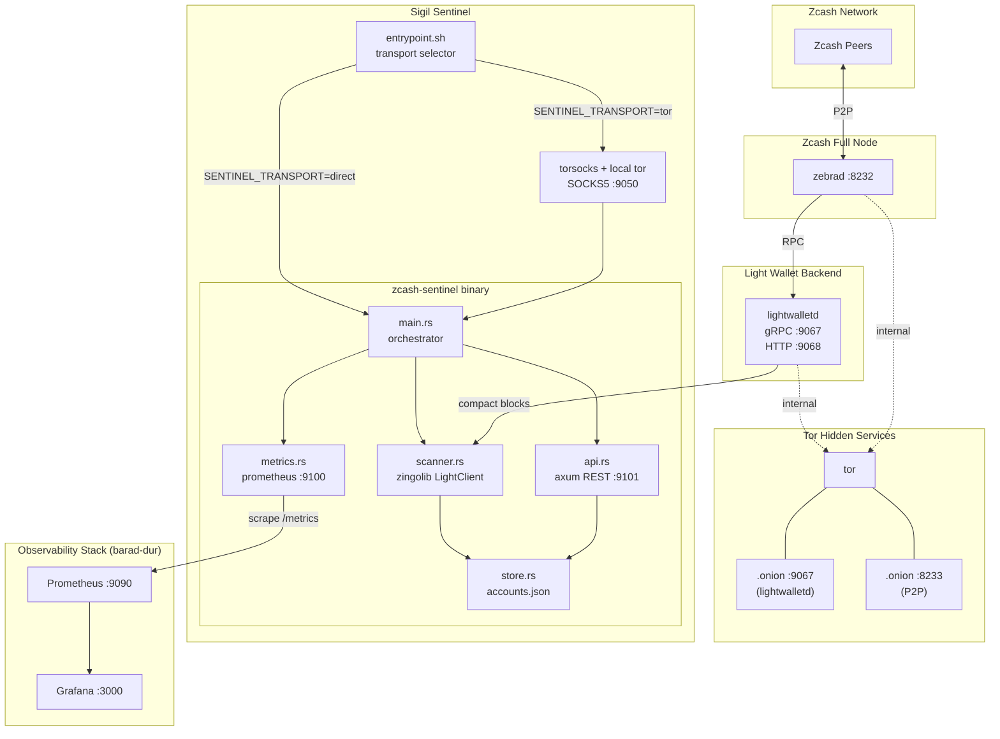
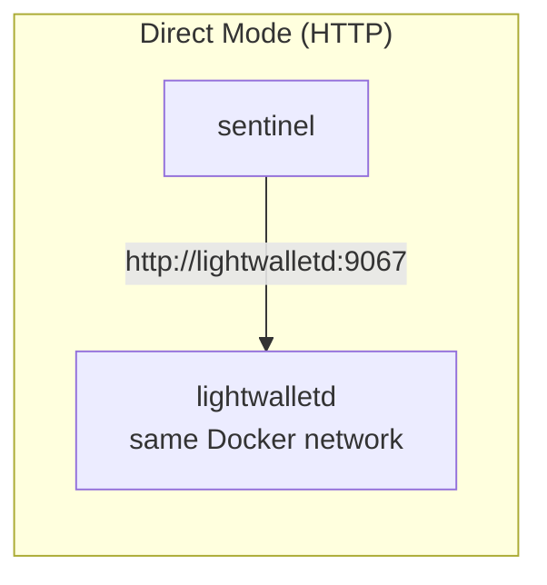
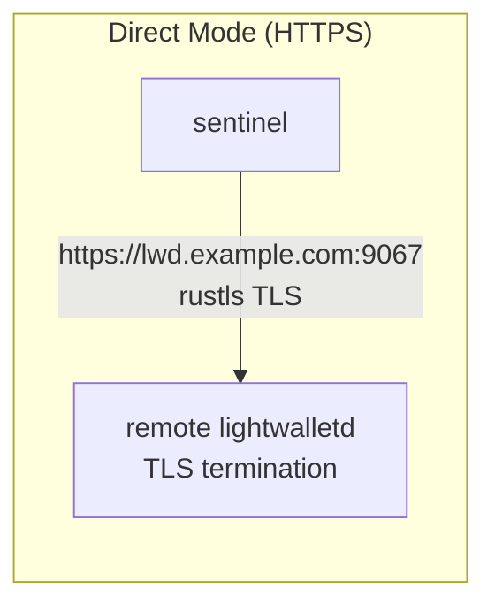
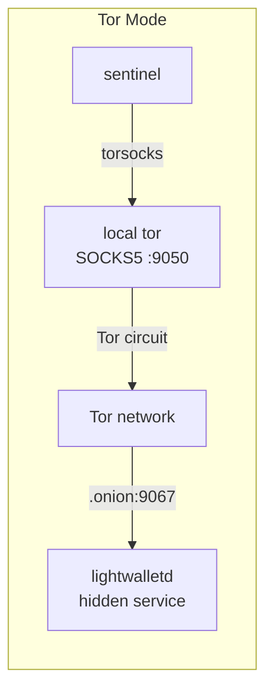
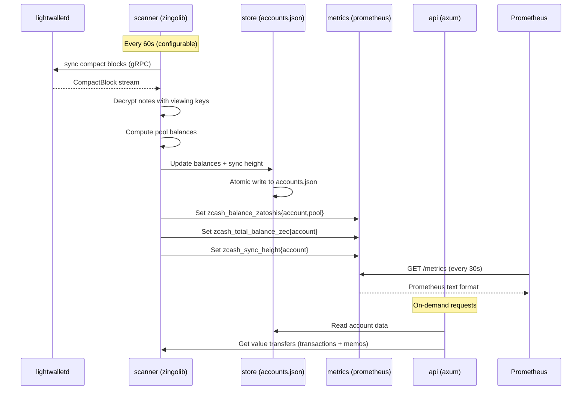

# Architecture

Sigil Sentinel is a balance monitoring service that sits between an existing Zcash lightwalletd endpoint and a Prometheus/Grafana observability stack. It uses zingolib as a light client library to scan compact blocks with viewing keys, and wraps it with an infrastructure layer that adds a REST API, Prometheus metrics, persistent state, and multi-transport connectivity.

## System Overview

## Transport Layer

The sentinel supports three connection modes to lightwalletd, selected by the `SENTINEL_TRANSPORT` environment variable. The transport is handled entirely at the infrastructure level — no Rust code changes between modes.

### How transport works

| Layer | HTTP | HTTPS | Tor |
|-------|------|-------|-----|
| Config endpoint | `http://host:9067` | `https://host:9067` | `http://xyz.onion:9067` |
| `SENTINEL_TRANSPORT` | `direct` | `direct` | `tor` |
| TLS | none | zingolib rustls (native) | none (Tor provides encryption) |
| DNS resolution | standard | standard | Tor exit / hidden service |
| Extra processes | none | none | local `tor` daemon |
| Binary wrapper | none | none | `torsocks` |

The `entrypoint.sh` script handles mode selection:

- **direct**: Runs `zcash-sentinel` directly. HTTP and HTTPS are both handled by zingolib's gRPC client, which uses `hyper` with an optional `rustls` TLS layer based on the URI scheme.
- **tor**: Starts a minimal Tor daemon as a SOCKS5 proxy on `127.0.0.1:9050`, waits for bootstrap, then runs `zcash-sentinel` through `torsocks`. This transparently routes all TCP connections (including gRPC to lightwalletd) through the Tor network. No application code is aware of Tor.

## Data Flow

## Component Responsibilities

| Component | File | Role |
|-----------|------|------|
| **Orchestrator** | `main.rs` | Config loading, shared state init, spawns scanner + API + metrics servers |
| **Scanner** | `scanner.rs` | Manages zingolib `LightClient` instances per account, periodic sync, balance + transaction queries |
| **API** | `api.rs` | REST endpoints for account CRUD, balance queries, transaction/memo retrieval, health checks |
| **Metrics** | `metrics.rs` | Prometheus gauge registration and exposition on `:9100/metrics` |
| **Store** | `store.rs` | JSON persistence for watched accounts/addresses with atomic writes |
| **Entrypoint** | `entrypoint.sh` | Transport mode selection (direct vs tor), Tor daemon lifecycle |

## Dependency Boundary

```mermaid
graph TB
    subgraph "Sigil Sentinel (this project)"
        API_L[REST API]
        MET_L[Prometheus Metrics]
        STORE_L[Persistent Storage]
        ENTRY_L[Transport Layer]
        ORCH_L[Orchestration]
    end

    subgraph "zingolib (external dependency)"
        LC[LightClient]
        PEP[pepper-sync<br/>block scanning engine]
        WAL[LightWallet<br/>note decryption + state]
        GRP[gRPC client<br/>tonic + hyper + rustls]
    end

    ORCH_L --> LC
    LC --> PEP
    LC --> WAL
    LC --> GRP

    style API_L fill:#2d5016
    style MET_L fill:#2d5016
    style STORE_L fill:#2d5016
    style ENTRY_L fill:#2d5016
    style ORCH_L fill:#2d5016
    style LC fill:#1a1a4e
    style PEP fill:#1a1a4e
    style WAL fill:#1a1a4e
    style GRP fill:#1a1a4e
```

**Green** = Sigil Sentinel (our code): REST API, metrics, persistence, transport, orchestration

**Blue** = zingolib (upstream dependency): light client library, block scanning, wallet primitives, gRPC connectivity

The sentinel consumes zingolib as a standard Rust crate dependency. All monitoring, API, infrastructure, and transport features are implemented independently of zingolib.
